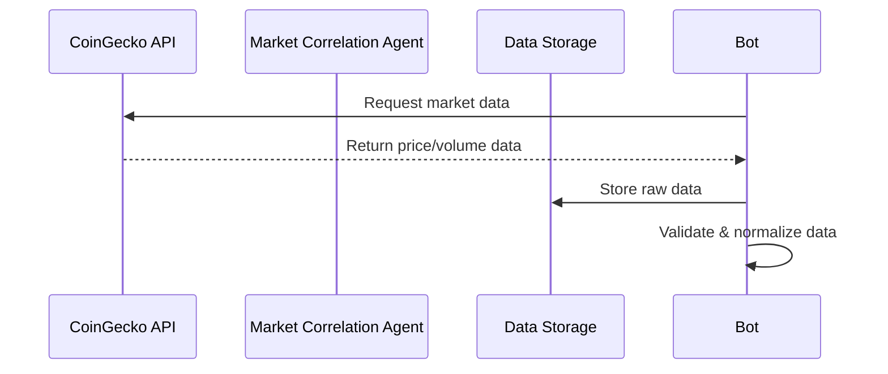
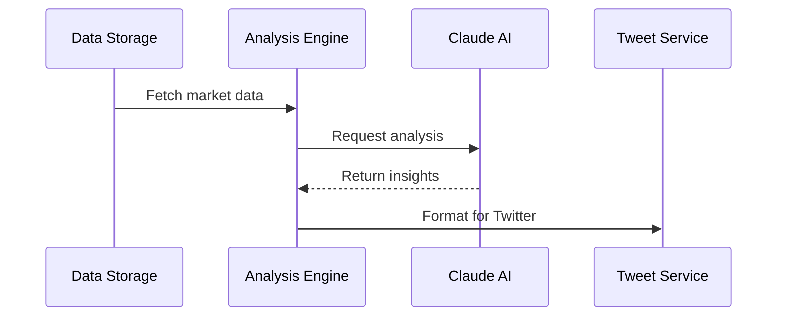
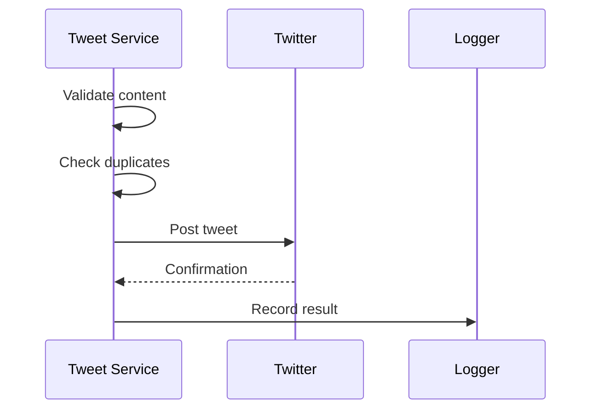

# System Architecture

## Overview
The Market Correlation Agent is built with a modular architecture focusing on reliability, maintainability, and scalability. This document outlines the system's core components, data flows, and dependencies.

## Component Overview

### 1. Browser Management System
```
ETHBTCCorrelationBot
├── Browser Controller (browser.py)
│   ├── Selenium WebDriver initialization
│   ├── Session management
│   └── Page interaction handlers
└── Error recovery mechanisms
```

**Key Features:**
- Automated browser session handling
- Robust error recovery
- Resource cleanup
- Page load timeout management
- Element wait strategies

### 2. API Integration Layer
```
API Services
├── CoinGecko Integration
│   ├── Market data fetching
│   ├── Rate limiting
│   └── Error handling
│
├── Claude AI Integration
│   ├── Analysis generation
│   ├── Request/response handling
│   └── Prompt management
│
└── Common Components
    ├── Request retry mechanism
    ├── Response validation
    └── Error standardization
```

**Communication Patterns:**
- RESTful API interactions
- Rate limit awareness
- Exponential backoff
- Circuit breaker implementation

### 3. Analysis Engine
```
Market Analysis
├── Data Collection
│   ├── Price aggregation
│   ├── Volume analysis
│   └── Trend detection
│
├── AI Processing
│   ├── Context preparation
│   ├── Analysis generation
│   └── Response parsing
│
└── Output Formatting
    ├── Tweet composition
    └── Length optimization
```

**Processing Pipeline:**
1. Raw data collection
2. Data normalization
3. AI analysis generation
4. Format optimization
5. Output validation

### 4. Twitter Posting Service
```
Twitter Integration
├── Authentication
│   ├── Login handling
│   └── Session management
│
├── Content Management
│   ├── Tweet composition
│   ├── Length verification
│   └── Duplicate detection
│
└── Posting Mechanism
    ├── Rate limiting
    ├── Error handling
    └── Success verification
```

**Key Operations:**
- Automated login
- Content validation
- Duplicate prevention
- Post scheduling
- Error recovery

### 5. Logging System
```
Logging Infrastructure
├── Logger Configuration
│   ├── Log levels
│   └── Output formatting
│
├── Event Categories
│   ├── System events
│   ├── Analysis events
│   ├── API events
│   └── Error events
│
└── Storage Management
    ├── Rotation policies
    └── Cleanup procedures
```

## Data Flow

### 1. Market Data Collection Process


### 2. Analysis Pipeline


### 3. Posting Workflow


## Dependencies

### External Dependencies
- **Selenium WebDriver**: Browser automation
- **Python Requests**: API communication
- **Anthropic Claude API**: Market analysis
- **CoinGecko API**: Market data
- **Chrome/ChromeDriver**: Web interaction

### Internal Dependencies
- **Config Module**: System configuration
- **Logger Module**: Logging infrastructure
- **Utils Package**: Common utilities
- **Browser Module**: Browser management

### Version Requirements
```
selenium==4.16.0
python-dotenv==1.0.0
requests==2.32.0
urllib3==2.0.7
certifi==2023.11.17
chardet==5.2.0
idna==3.6
six==1.16.0
```

## Error Handling

### Retry Mechanisms
- API request retries
- Browser operation retries
- Authentication retries
- Post attempt retries

### Error Recovery
- Session recovery
- Connection reset handling
- Timeout management
- Resource cleanup

## Performance Considerations

### Optimization Points
- Browser resource management
- API request caching
- Connection pooling
- Memory management

### Bottleneck Prevention
- Rate limit monitoring
- Resource usage tracking
- Connection pooling
- Cache management

## Security Architecture

### Authentication
- Secure credential storage
- Session management
- API key protection

### Data Protection
- HTTPS enforcement
- Secure environment variables
- Minimal data retention

## Future Considerations

### Scalability Points
- Multiple account support
- Enhanced analysis capabilities
- Additional data sources
- Performance optimization

### Potential Improvements
- Distributed architecture
- Real-time analysis
- Machine learning integration
- Advanced monitoring
