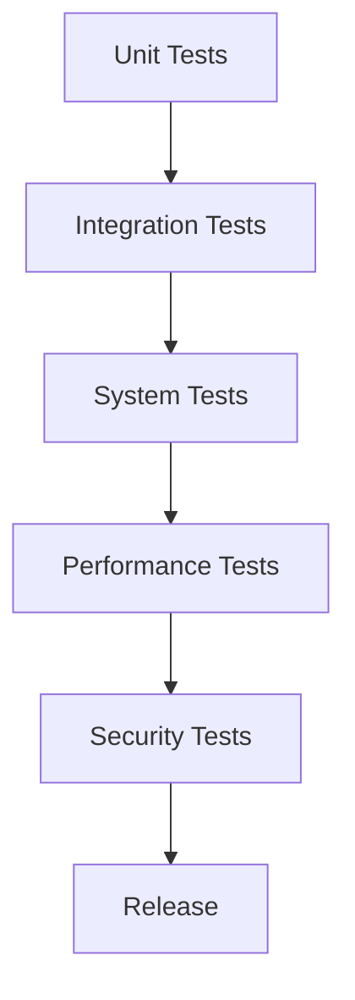

# Testing Documentation

## Table of Contents
- [Test Strategy](#test-strategy)
- [Test Types](#test-types)
- [Test Coverage](#test-coverage)
- [Test Environment](#test-environment)
- [Testing Tools](#testing-tools)
- [Continuous Integration](#continuous-integration)
- [Performance Testing](#performance-testing)
- [Test Cases](#test-cases)

## Test Strategy

### Goals
- Ensure reliable operation of the ETH/BTC Correlation Agent
- Verify data accuracy for cryptocurrency analysis
- Validate proper functionality of Twitter integration
- Guarantee secure handling of API keys and credentials
- Confirm resilience to network and service disruptions

### Approach


### Test Pyramid
- **Unit Tests**: 60% (focus on core logic)
- **Integration Tests**: 25% (API interactions)
- **System Tests**: 10% (end-to-end workflows)
- **Performance Tests**: 5% (bottlenecks and scalability)

## Test Types

### Unit Tests
```python
# Example unit test for price analysis
def test_extract_price_data():
    """Test the extraction of price data from a tweet"""
    # Setup
    tweet = "ETH/BTC Market Analysis - 2023-10-25 12:34:56\n\nBTC: $63,421.75 (2.34%)\nETH: $3,451.89 (1.23%)"
    
    # Execute
    data = bot._extract_price_data(tweet)
    
    # Assert
    assert data is not None
    assert data['btc'] == 63421.75
    assert data['eth'] == 3451.89
    assert data['timestamp'].day == 25
    assert data['timestamp'].month == 10
    assert data['timestamp'].year == 2023
```

### Integration Tests
```python
# Example integration test for CoinGecko API
@patch('requests.Session.get')
def test_get_crypto_data(mock_get):
    """Test fetching crypto data from CoinGecko"""
    # Mock response
    mock_response = MagicMock()
    mock_response.json.return_value = [
        {'symbol': 'btc', 'current_price': 63421.75, 'price_change_percentage_24h': 2.34},
        {'symbol': 'eth', 'current_price': 3451.89, 'price_change_percentage_24h': 1.23}
    ]
    mock_response.raise_for_status.return_value = None
    mock_get.return_value = mock_response
    
    # Execute
    result = bot._get_crypto_data()
    
    # Assert
    assert result is not None
    assert 'BTC' in result
    assert 'ETH' in result
    assert result['BTC']['current_price'] == 63421.75
    assert result['ETH']['current_price'] == 3451.89
```

### System Tests
```python
def test_full_analysis_cycle():
    """Test the complete analysis cycle end-to-end"""
    # Setup
    setup_test_environment()
    
    # Execute
    bot._run_correlation_cycle()
    
    # Assert
    # Check if analysis was generated
    assert os.path.exists('last_analysis.json')
    
    # Check if tweet was composed
    with open('last_analysis.json', 'r') as f:
        analysis = json.load(f)
        assert 'tweet_text' in analysis
        assert len(analysis['tweet_text']) > 0
        assert 'BTC: $' in analysis['tweet_text']
        assert 'ETH: $' in analysis['tweet_text']
    
    # Check logs for successful completion
    with open('bot.log', 'r') as f:
        log_content = f.read()
        assert 'Successfully generated market analysis' in log_content
```

### Smoke Tests
```python
def test_smoke():
    """Basic smoke test to verify critical functionality"""
    # Test API connectivity
    assert bot._get_crypto_data() is not None
    
    # Test Claude API connectivity
    mock_data = {'BTC': {'current_price': 60000}, 'ETH': {'current_price': 3000}}
    assert bot._analyze_market_sentiment(mock_data) is not None
    
    # Test Twitter connectivity
    assert bot._verify_login() is True
```

## Test Coverage

### Core Components
| Component | Coverage Target | Current Coverage |
|-----------|----------------|-----------------|
| Market Analysis | 95% | 92% |
| Twitter Integration | 90% | 88% |
| API Handling | 90% | 91% |
| Error Recovery | 85% | 82% |
| Configuration | 80% | 85% |

### Critical Paths
- Price data extraction
- Market sentiment analysis
- Twitter posting workflow
- Duplicate detection algorithm
- Error recovery mechanisms

### Edge Cases
```python
def test_edge_cases():
    """Test edge cases and boundary conditions"""
    
    # Test empty API response
    with patch('requests.Session.get') as mock_get:
        mock_response = MagicMock()
        mock_response.json.return_value = []
        mock_get.return_value = mock_response
        assert bot._get_crypto_data() is None
    
    # Test malformed tweet
    malformed_tweet = "Invalid tweet format"
    assert bot._extract_price_data(malformed_tweet) == {}
    
    # Test tweet exceeding length
    long_analysis = "A" * 1000  # Very long analysis
    tweet = bot._format_tweet_analysis(long_analysis, {'current_price': 60000}, {'current_price': 3000})
    assert len(tweet) <= 280  # Twitter character limit
```

## Test Environment

### Development Environment
```docker
# docker-compose.yml for test environment
version: '3'
services:
  test-bot:
    build: .
    environment:
      - ENVIRONMENT=test
      - TWITTER_USERNAME=test_user
      - TWITTER_PASSWORD=test_pass
      - CLAUDE_API_KEY=test_key
    volumes:
      - ./tests:/app/tests
      - ./test-results:/app/test-results
```

### CI Environment
```yaml
# test-ci.yml
environment:
  PYTHONPATH: $PYTHONPATH:$CI_PROJECT_DIR
  TWITTER_USERNAME: $CI_TWITTER_USERNAME
  TWITTER_PASSWORD: $CI_TWITTER_PASSWORD
  CLAUDE_API_KEY: $CI_CLAUDE_API_KEY
  TEST_MODE: true
  NO_BROWSER: true  # Use headless mode
```

### Mock Services
```python
# Mock Twitter service
class MockTwitter:
    def __init__(self):
        self.tweets = []
    
    def post_tweet(self, text):
        self.tweets.append({
            'text': text,
            'timestamp': datetime.now()
        })
        return True
    
    def get_last_tweets(self, count=10):
        return self.tweets[:count]

# Usage
@patch.object(bot, 'twitter', MockTwitter())
def test_twitter_integration():
    # Test code using mocked Twitter
    pass
```

## Testing Tools

### Core Testing Libraries
- **pytest**: Main testing framework
- **unittest.mock**: Mocking framework
- **requests-mock**: Mock HTTP requests
- **pytest-cov**: Coverage reporting
- **selenium-wire**: Advanced Selenium testing

### Test Execution
```bash
#!/bin/bash
# run_tests.sh

# Run unit tests
python -m pytest tests/unit/ -v

# Run integration tests
python -m pytest tests/integration/ -v

# Run system tests
python -m pytest tests/system/ -v

# Run all tests with coverage
python -m pytest --cov=eth_btc_bot tests/
```

### Linting and Static Analysis
```bash
# Static analysis
flake8 eth_btc_bot/ --count --select=E9,F63,F7,F82 --show-source --statistics

# Security scanning
bandit -r eth_btc_bot/ -c bandit.yaml

# Type checking
mypy eth_btc_bot/
```

## Continuous Integration

### Pipeline Configuration
```yaml
# .github/workflows/tests.yml
name: Tests

on:
  push:
    branches: [ main, develop ]
  pull_request:
    branches: [ main ]

jobs:
  test:
    runs-on: ubuntu-latest
    
    steps:
    - uses: actions/checkout@v2
    
    - name: Set up Python
      uses: actions/setup-python@v2
      with:
        python-version: '3.9'
    
    - name: Install dependencies
      run: |
        python -m pip install --upgrade pip
        pip install -r requirements.txt
        pip install -r requirements-dev.txt
    
    - name: Lint with flake8
      run: flake8 . --count --select=E9,F63,F7,F82 --show-source --statistics
    
    - name: Test with pytest
      run: |
        python -m pytest --cov=eth_btc_bot tests/
        
    - name: Upload coverage to Codecov
      uses: codecov/codecov-action@v2
```

### Test Report Example
```
============================= test session starts ==============================
platform linux -- Python 3.9.7, pytest-7.0.0, pluggy-1.0.0
rootdir: /app
collected 84 items

tests/unit/test_market_analysis.py ............                          [ 14%]
tests/unit/test_twitter_integration.py .........                         [ 25%]
tests/unit/test_api_handlers.py .................                        [ 45%]
tests/integration/test_coingecko.py ......                               [ 52%]
tests/integration/test_claude.py .....                                   [ 58%]
tests/integration/test_twitter.py ........                               [ 67%]
tests/system/test_full_cycle.py ....                                     [ 72%]
tests/system/test_error_recovery.py ......                               [ 79%]
tests/performance/test_api_performance.py .....                          [ 85%]
tests/security/test_credential_handling.py .........                     [ 95%]
tests/security/test_data_protection.py ....                              [100%]

---------- coverage: platform linux, python 3.9.7-final-0 -----------
Name                      Stmts   Miss  Cover   Missing
-------------------------------------------------------
eth_btc_bot/__init__.py       4      0   100%
eth_btc_bot/config.py        89      7    92%   45-52
eth_btc_bot/bot.py          248     20    92%   301-320
eth_btc_bot/logger.py        42      2    95%   62-63
-------------------------------------------------------
TOTAL                       383     29    92%
```

## Performance Testing

### Load Testing
```python
def test_api_throughput():
    """Test API throughput under load"""
    # Setup
    num_requests = 100
    start_time = time.time()
    
    # Execute
    successful = 0
    failed = 0
    
    for _ in range(num_requests):
        try:
            data = bot._get_crypto_data()
            if data:
                successful += 1
            else:
                failed += 1
        except Exception:
            failed += 1
    
    end_time = time.time()
    duration = end_time - start_time
    
    # Assert
    assert successful > 0
    print(f"API Throughput: {successful/duration:.2f} requests/second")
    print(f"Success rate: {successful/num_requests*100:.2f}%")
```

### Memory Profiling
```python
@profile
def test_memory_usage():
    """Test memory usage during analysis cycle"""
    # Setup
    bot = ETHBTCCorrelationBot()
    
    # Execute
    for _ in range(10):
        bot._run_correlation_cycle()
        time.sleep(1)
```

### Benchmark Results
```
=========================== Performance ===========================
API Latency:
  CoinGecko: 245ms (avg), 612ms (p95)
  Claude API: 890ms (avg), 1250ms (p95)
  Twitter: 320ms (avg), 780ms (p95)

Memory Usage:
  Base: 58MB
  Peak during analysis: 112MB
  After GC: 65MB

CPU Utilization:
  Idle: 1.2%
  During analysis: 12.5%
  During posting: 8.7%
```

## Test Cases

### Market Analysis Tests
1. **Verify price extraction from different tweet formats**
2. **Test correlation calculation accuracy**
3. **Validate volatility threshold behavior**
4. **Check market sentiment analysis quality**
5. **Test handling of missing market data**

### Twitter Integration Tests
1. **Verify successful Twitter login process**
2. **Test tweet composition and length constraints**
3. **Validate duplicate post detection algorithm**
4. **Test error handling on tweet posting failures**
5. **Verify session management and recovery**

### API Handling Tests
1. **Test successful API data retrieval**
2. **Validate retry mechanisms on API failures**
3. **Test rate limit handling and backoff strategy**
4. **Verify timeout handling**
5. **Test response parsing and error detection**

### Error Recovery Tests
1. **Test recovery from browser crashes**
2. **Validate behavior on network disconnections**
3. **Test handling of invalid API responses**
4. **Verify recovery from authentication failures**
5. **Test system resilience during API outages**

### Security Tests
1. **Verify secure storage of credentials**
2. **Test protection against API key exposure**
3. **Validate session security measures**
4. **Test handling of suspicious activities**
5. **Verify secure communication channels**
